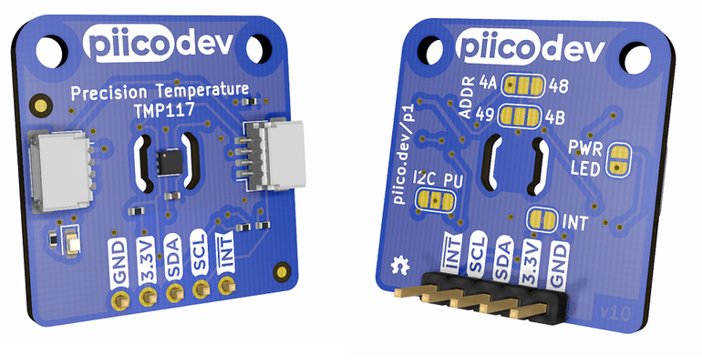

# PiicoDev Precision Temperature Sensor TMP117

This is the repo for the [PiicoDev](https://piico.dev) Precision Temperature Sensor TMP117 PCB.

The TMP117 is a low-power, high-precision temperature sensor with an accuracy up to +/-0.1 °C (over range -20 to +50 °C) with no calibration required. The device has an operating range of -55 °C to +150 °C.

On-board jumpers allow for selecting four different addresses.

# License
---
This project is open source - please review the LICENSE.md file for further licensing information.

If you have any technical questions, or concerns about licensing, please contact technical support on the [Core Electronics forums](https://forum.core-electronics.com.au/).

# Attribution
---
The hardware design of this module is influenced by the design from [Sparkfun](https://github.com/sparkfun/SparkFun_High_Precision_Temperature_Sensor_TMP117_Qwiic).

---
*\"PiicoDev\" and the PiicoDev logo are trademarks of Core Electronics Pty Ltd.*
